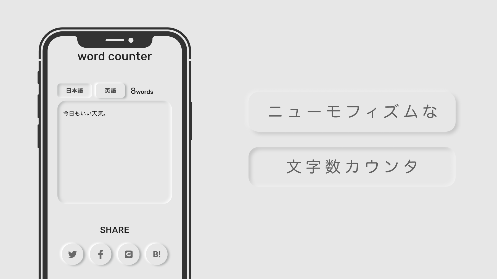

# word counter
https://count-words.web.app/


word counter is a word counting web application. You can count number of words in English and Japanese.

# Usage
Clone it.
```
git clone git@github.com:kmrmjr/word_counter.git
```

Install dependences.
```
npm install
```

Start server on `localhost:8080` and enjoy.
```
npm run serve
```
# Auther
- Kaito Kimura
- setoengr@gmail.com

# Licence
Watt Changer is under MIT Licence
